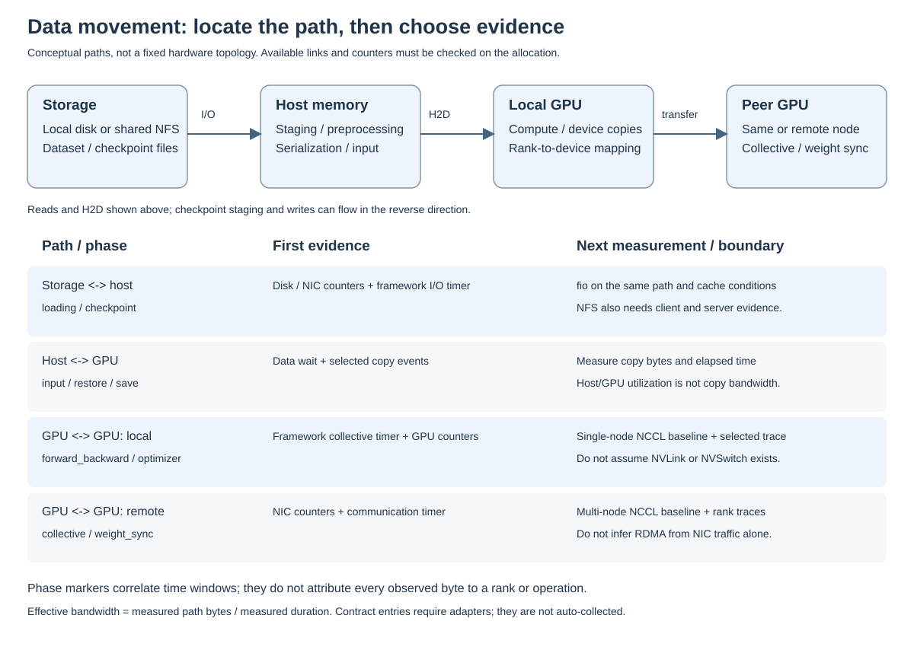

# Tooling and Coverage Gaps

먼저 상시 수집하는 자원 지표(metric)로 느린 노드와 시간대를 찾고, 해당 구간의 상세 실행 기록(trace)으로 원인을 확인합니다.
Metric은 시간별 사용량과 지연을 비교하기 좋고, trace는 연산·통신의 실행 순서를 보여줍니다.
아래 표에서 알고 싶은 질문에 맞는 도구를 선택하세요.

## Recommended Open-source Stack

| Question | Tool | Collection mode | Boundary |
| --- | --- | --- | --- |
| 어느 node의 CPU, memory, NIC 또는 disk가 포화됐는가? | Prometheus Node Exporter | Always on | rank와 framework phase를 알지 못함 |
| 어느 container 또는 cgroup이 host 자원을 사용했는가? | cAdvisor | When container isolation matters | framework phase와 GPU activity를 알지 못함 |
| Storage→host→GPU와 GPU 간 전송이 어느 phase에 집중되는가? | Framework phase marker + exporter correlation | Always on summary | 정확한 copy/collective causality는 selected trace 필요 |
| 어느 GPU가 idle, memory-bound 또는 throttled 상태인가? | NVIDIA DCGM Exporter | Always on | exporter는 OSS지만 NVIDIA driver/DCGM에 의존함 |
| Ray actor가 pending/restarting되거나 object store가 spill하는가? | Ray metrics and Dashboard | Always on | verl의 rollout/training 의미는 별도 metric 필요 |
| 여러 signal을 어떻게 저장하고 비교하는가? | Prometheus and Grafana | Always on | event causality와 kernel timeline은 제공하지 않음 |
| rollout과 tool call의 critical path는 무엇인가? | OpenTelemetry Collector and Tempo | Sampled traces | CUDA/NCCL 내부는 보이지 않음 |
| 어떤 operator/kernel/collective에서 시간이 소요되는가? | PyTorch Profiler/Kineto | Selected ranks and steps | 장시간·전 rank capture는 overhead와 artifact가 큼 |
| 여러 rank의 compute/communication/idle 차이는 무엇인가? | Holistic Trace Analysis | Offline | 호환되는 Kineto trace와 rank mapping 필요 |
| trace를 어떻게 육안으로 확인하는가? | Perfetto or TensorBoard | Offline | 분석할 capture 자체는 별도로 생성해야 함 |
| cluster fabric의 정상 성능은 얼마인가? | NCCL Tests | Before/after workload | application throughput이 아닌 baseline |
| checkpoint/data storage의 정상 성능은 얼마인가? | fio | Before/after workload | 실제 workload와 같은 I/O pattern을 모델링해야 함 |

## Three Profiling Layers

### 1. Always-on telemetry

기본 Compose는 Node Exporter와 DCGM Exporter endpoint를 수집하며, application target 목록은 비어 있습니다.
Ray/vLLM/verl endpoint와 role dashboard를 추가하면 framework 신호도 함께 비교할 수 있습니다.
Exporter target의 `run_id`는 allocation을 연결하는 label이며 해당 run의 process만 격리해 측정하지는 않습니다.
이 계층은 regression, imbalance와 이상 시점을 찾는 데 사용하며 profiler를 켜지 않은 기준 성능을 보존합니다.

### 2. Framework semantics

학습 framework의 지표를 사용해 GPU가 쉬는 이유를 분류합니다.
Megatron timer와 `StragglerDetector`, verl의 rollout 통계, Ray actor 상태를 함께 보면 데이터·통신·생성·보상 계산·도구 호출 중 어디서 기다리는지 좁힐 수 있습니다.
노드 사용량을 수집하는 exporter만으로는 이 구분이 어려워 framework와 연결하는 adapter가 필요합니다.

### 3. Selected diagnostic trace

이상 rank와 step이 확인된 후 PyTorch Profiler/Kineto를 짧게 실행하고 HTA/Perfetto로 분석합니다.
기준 run과 trace run은 분리하며 capture rank, step, option과 tool version을 manifest에 기록합니다.

## Metric Contract and Phase Correlation

Canonical name, unit, scope, source와 collection policy는 [`config/metrics.json`](../../observability/config/metrics.json)에 정의합니다.
[`config/metrics.schema.json`](../../observability/config/metrics.schema.json)은 JSON file의 구조를 검증하고 [Profiling metric contract](metric-schema.md)는 label, manifest field와 phase vocabulary의 사용 방법을 설명합니다.

Dataset/model loading, training input, forward/backward, optimizer, checkpoint와 evaluation을 같은 phase vocabulary로 기록합니다.
각 path에서 bytes와 duration을 얻을 수 있으면 effective bandwidth를 계산하고, NCCL Tests 또는 fio baseline 대비 workload utilization을 별도 derived metric으로 저장합니다.

Local NVMe와 remote/shared storage는 동일한 `storage_read_bytes_per_second`만으로 구분하지 않습니다.
Storage path type, filesystem, mount, cache state와 node topology는 run manifest에 기록하고, remote storage는 client disk/filesystem, storage network와 server 측 metric을 함께 봅니다.
Client exporter만으로 backend contention이나 cache hit의 원인을 확정하지 않습니다.

## What Open Source Alone Cannot Fully Resolve

| Gap | Why | Practical completion path |
| --- | --- | --- |
| 정확한 CUDA kernel launch와 NCCL system timeline | Prometheus는 집계값이고 OpenTelemetry는 GPU runtime 내부를 모름 | Kineto로 먼저 확인하고 불충분하면 일부 rank/step에 Nsight Systems 사용 |
| Kernel의 occupancy, memory throughput와 stall 원인 | operator duration만으로 microarchitecture 원인을 확정할 수 없음 | isolated reproduction에 Nsight Compute 같은 vendor counter tool 사용 |
| 완전한 NVIDIA telemetry 독립성 | DCGM Exporter 아래의 driver, DCGM와 hardware counter는 vendor stack | dependency와 version을 manifest에 명시하고 exporter/DCGM 조합을 고정 |
| 자동 cross-node trace correlation | clock skew, rank mapping, trace merge와 실패 복구가 남음 | PTP/NTP 상태와 rank map을 저장하고 selected trace만 중앙 수집 |
| Agent quality/performance trade-off | resource profiler는 reward와 output quality를 판단하지 못함 | 같은 run comparison에 reward, evaluation과 policy-quality gate 포함 |
| Tool/environment 내부 지연 | verl/Ray는 외부 service의 세부 대기 원인을 모를 수 있음 | OpenTelemetry span을 agent, tool gateway와 environment에 전파 |

vendor tool은 상시 stack의 필수 요소로 두지 않습니다.
오픈소스 metric과 trace로 원인을 좁힌 뒤, 더 낮은 계층의 증거가 필요한 짧은 diagnostic run에서만 사용합니다.

## Run Identity and Cardinality

Label 값의 종류가 계속 늘어나면 시계열 수와 저장 비용도 늘어납니다.
이 값의 가짓수를 cardinality라고 부릅니다.
Prometheus label에는 `run_id`, `cluster`, `job`, `node`, `gpu`, `framework`, `role`처럼 검색에 자주 쓰이고 cardinality가 제한된 값만 둡니다.
Git commit, image digest, dataset/checkpoint URI, rank map과 profiler option은 manifest에 보존합니다.
request ID, prompt, tool argument와 timestamp를 metric label로 만들지 말고, 개별 episode 분석이 필요하면 sampled OpenTelemetry trace attribute로 저장합니다.

## References

- [Megatron Core parallelism strategies](https://docs.nvidia.com/megatron-core/developer-guide/latest/user-guide/parallelism-guide.html)
- [Megatron Core timers](https://docs.nvidia.com/megatron-core/developer-guide/latest/apidocs/core/core.timers.html)
- [Megatron Core StragglerDetector](https://docs.nvidia.com/megatron-core/developer-guide/latest/apidocs/core/core.utils.html)
- [verl rollout monitoring](https://verl.readthedocs.io/en/latest/advance/grafana_prometheus.html)
- [Ray metrics](https://docs.ray.io/en/latest/cluster/metrics.html)
- [Prometheus Node Exporter](https://prometheus.io/docs/guides/node-exporter/)
- [NVIDIA DCGM Exporter](https://docs.nvidia.com/datacenter/dcgm/latest/installation/install-dcgm-exporter.html)
- [OpenTelemetry Collector](https://opentelemetry.io/docs/collector/)
- [Grafana Tempo](https://grafana.com/docs/tempo/latest/)
- [PyTorch Profiler](https://docs.pytorch.org/docs/stable/profiler.html)
- [Kineto](https://github.com/pytorch/kineto)
- [Holistic Trace Analysis](https://github.com/facebookresearch/HolisticTraceAnalysis)
- [NCCL Tests](https://github.com/NVIDIA/nccl-tests)
